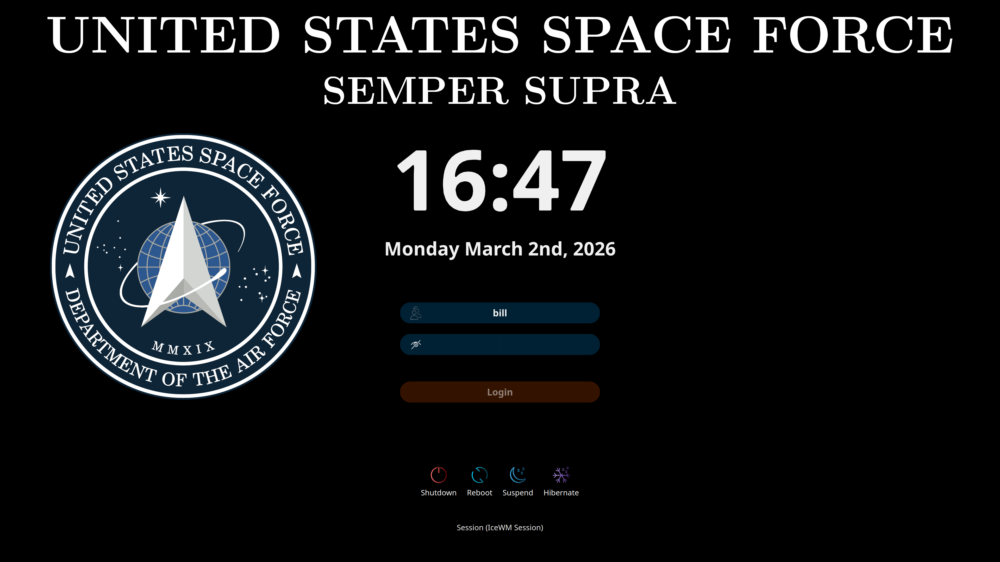
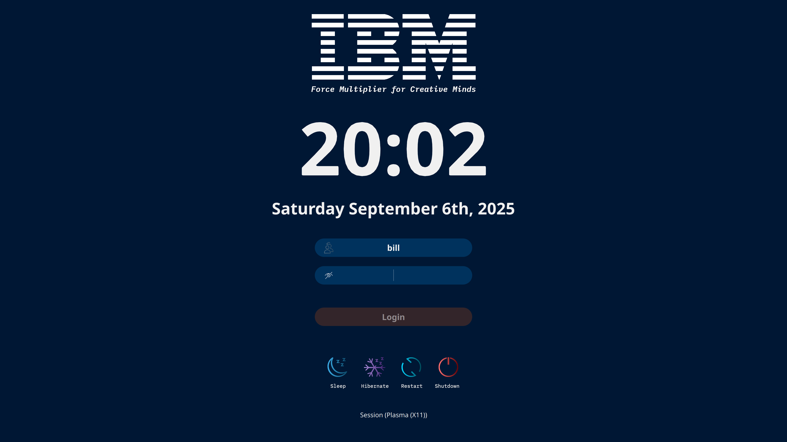
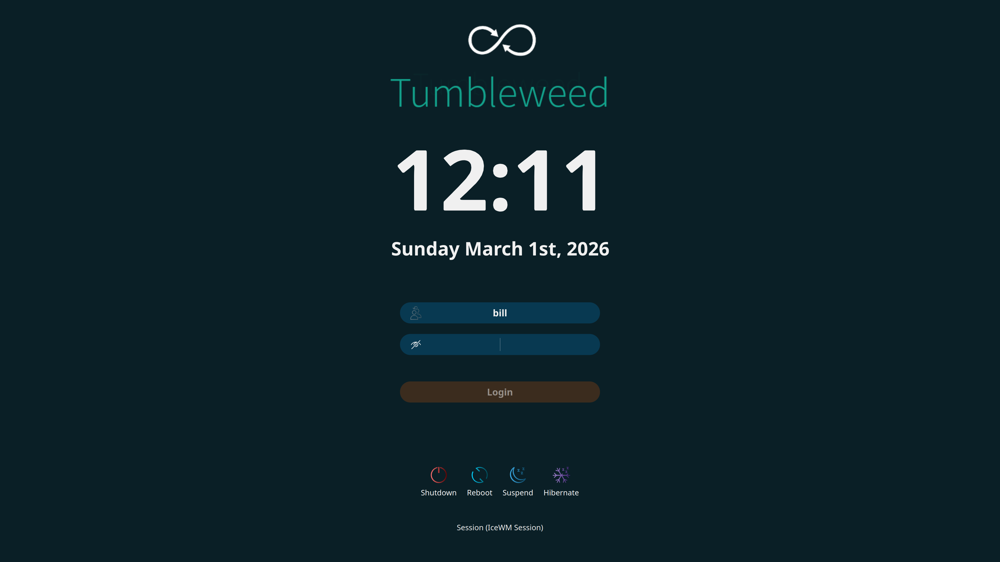
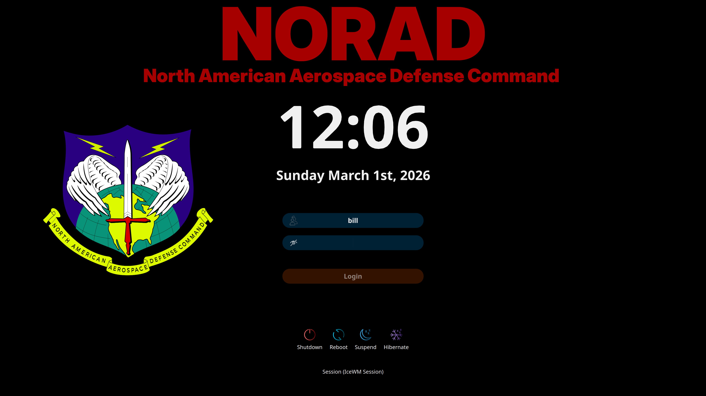
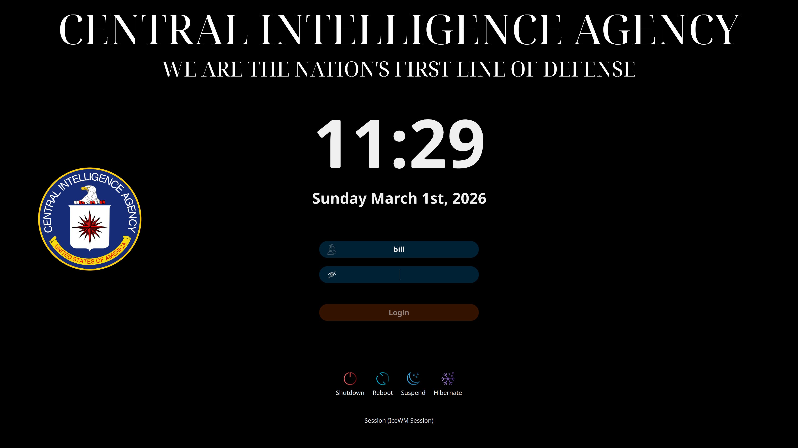
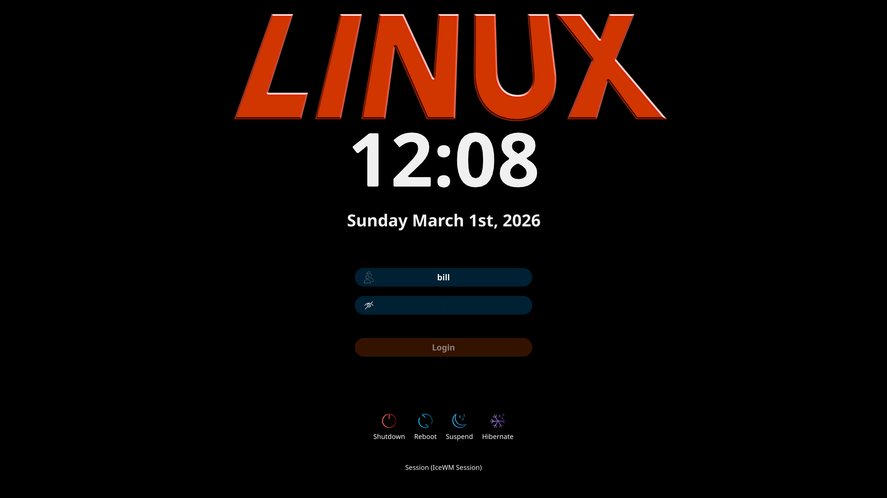

# SDDM-CORPORATE-THEME

<!-- mtoc-start -->

* [History of this Theme](#history-of-this-theme)
  * [Marian Arlt's SDDM-SUGAR-DARK-THEME](#marian-arlts-sddm-sugar-dark-theme)
    * [Essential Features Provided by SUGAR-DARK](#essential-features-provided-by-sugar-dark)
    * [Synopsis](#synopsis)
* [Objective](#objective)
  * [Keyitdev's SDDM-ASTRONAUT-THEME](#keyitdevs-sddm-astronaut-theme)
    * [Essential Features Provided by ASTRONAUT](#essential-features-provided-by-astronaut)
* [Bill Waller's SDDM-CORPORATE-THEME](#bill-wallers-sddm-corporate-theme)
  * [Files Modified Include](#files-modified-include)
  * [Installation](#installation)
  * [Testing](#testing)
  * [Changing the Background](#changing-the-background)

<!-- mtoc-end -->

## History of this Theme

### Marian Arlt's SDDM-SUGAR-DARK-THEME

[by Marian Arlt at https://github.com/MarianArlt/sddm-sugar-dark](https://github.com/MarianArlt/sddm-sugar-dark)

[Distributed under: GPLv3+ License https://www.gnu.org/licenses/gpl-3.0.html](https://www.gnu.org/licenses/gpl-3.0.html)

#### Essential Features Provided by SUGAR-DARK

- Space for a Corporate Logo
- Time and Date
- Drop Down User Selection Menu
- Drop Down Session Selection Menu
- Show/Hide Password
- System Functions Including Restart and Shutdown

#### Synopsis

Of all the SDDM Greeter Themes, SDDM-SUGAR-DARK by Marian Arlt upgraded as SDDM-ASTRONAUT by Keyitdev is, by a wide margin, the most capable and versatile I have seen. SDDM-CORPORATE is essentially SDDM-ASTRONAUT with some minor configuration changes.

## Objective

### Keyitdev's SDDM-ASTRONAUT-THEME

[by Keyitdev at https://github.com/Keyitdev/sddm-astronaut-theme](https://github.com/Keyitdev/sddm-astronaut-theme)

Copyright (C) 2022-2025 Keyitdev

#### Essential Features Provided by ASTRONAUT

- Compatibility with QT6
- User Friendly Setup

## Bill Waller's SDDM-CORPORATE-THEME

[https://github.com/BillWaller/sddm-corporate-theme](https://github.com/BillWaller/sddm-corporate-theme)












What's so special about SDDM-CORPORATE? Nothing. It doesn't even have its own pretty scenery, but preserves the functionality SDDM-ASTRONAUT, while adding minor cosmetic improvements. It's a stripped down, plain vanilla, configuration.

Just provide a background image matching your display's resolution and place it in the Backgrounds directory, or select one of the background images provided with SDDM-ASTRONAUT. If you elect to create your own background, the top fourth and lateral two-thirds of the screen are available and unobstructed.

The changes are cosmetic, and include:


More colorful System Icons
Larger and more colorful user name and password field icons
Additional date format: "dddd MMMM d" -> "Thursday September 11th 2025"

### Files Modified Include

Themes/corporate.conf
Components/Input.qml
Components/Clock.qml
Assets-Original (Copy of Original Icons)
Assets-Corporate (New Icons)
Assets (Copy of New Icons)
sddm-corporate.patch

### Installation

[Clone sddm-corporate-theme](https://github.com/BillWaller/sddm-corporate-theme.git)

Copy the sddm-corporate-theme directory structure to
/usr/share/sddm/themes/breeze/

```bash
sudo cp -Rpdu sddm-corporate-theme /usr/share/sddm/themes
```

Edit /etc/sddm.conf.d/sddm.conf or /etc/sddm.conf depending on your system.

Under \[Theme\], set
Current=sddm-corporate-theme

```bash
sudo vi /etc/sddm.conf.d/sddm.conf
or
sudo vi /etc/sddm.conf
```

### Testing

Edit the bash script, /usr/share/sddm/themes/sddm-corporate-theme/sddm.sh

Verify that QML_IMPORT_PATH is set properly according to the topography of
your system.

```bash
#!/bin/bash
export QML_IMPORT_PATH=/usr/lib64/qt6/qml:/usr/lib64/qt5/qml
export LC_ALL="en_US.UTF-8"
theme=sddm-corporate-theme
sddm env -i HOME="$HOME" DISPLAY="$DISPLAY" XAUTHORITY="$XAUTHORITY" \
    sddm-greeter-qt6 \
    --test-mode \
    --qwindowgeometry 3840x2160+0+0 \
    --theme /usr/share/sddm/themes/$theme
```

Before running this script, you should know that you can exit the sddm test-mode, by
pressing press Alt-Tab. You will get an option to end the program.

Run the script, /usr/share/sddm/themes/sddm-corporate-theme/sddm.sh

Press Alt-Tab to exit sddm test-mode.

### Changing the Background

```bash
sudo vi /usr/share/sddm/themes/sddm-corporate-theme/Themes/corporate.conf
```

Set Background=Backgrounds/yourbackground.png

Where your background is one of the png files in

```bash
ls /usr/share/sddm/themes/sddm-corporate-theme/Backgrounds
```

Currently, four backgrounds are included in the distribution. They are:

cia.png, ibm.png, linux.png, norad.png, and tumbleweed.png

These backgrounds are shown as displayed by sddm in

```bash
ls /usr/share/sddm/themes/sddm-corporate-theme/Previews
```

They have the same file names as the backgrounds.

---
Enjoy 🐸
---
